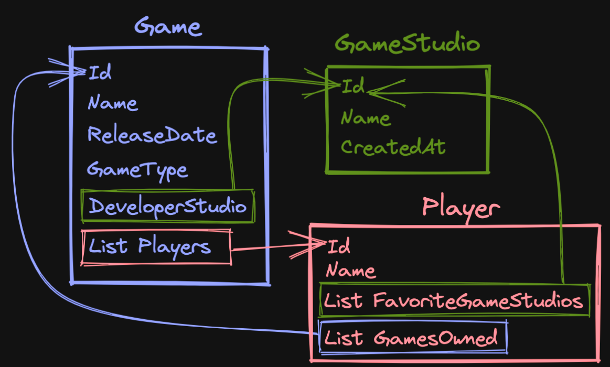
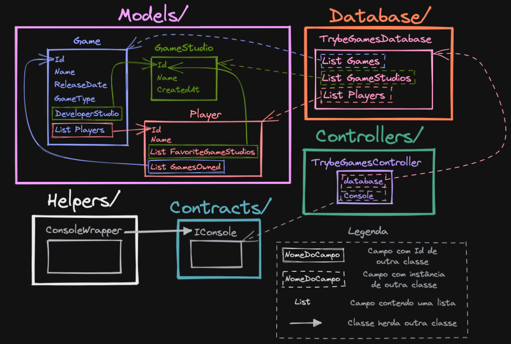

# Boas-vindas ao repositório do projeto Trybe Games

Para realizar o projeto, atente-se a cada passo descrito a seguir. Se tiver qualquer dúvida, nos envie por _Slack_! #vqv 🚀

Aqui você vai encontrar os detalhes de como estruturar o desenvolvimento do seu projeto a partir deste repositório, utilizando uma branch específica e um _Pull Request_ para colocar seus códigos.

# Termos e acordos

Ao iniciar este projeto, você concorda com as diretrizes do Código de Conduta e do Manual da Pessoa Estudante da Trybe.

# Orientações

<details>
  <summary><strong>‼️ Antes de começar a desenvolver</strong></summary><br />

  1. Clone o repositório

  - Use o comando: `git clone git@github.com:tryber/acc-csharp-0x-project-trybe-games.git`.
  - Entre na pasta do repositório que você acabou de clonar:
    - `cd acc-csharp-0x-project-trybe-games`

  2. Instale as dependências
  
  - Entre na pasta `src/`.
  - Execute o comando: `dotnet restore`.
  
  3. Crie uma branch a partir da branch `master`

  - Verifique se você está na branch `master`.
    - Exemplo: `git branch`
  - Se não estiver, mude para a branch `master`.
    - Exemplo: `git checkout master`
  - Agora crie uma branch à qual você vai submeter os `commits` do seu projeto.
    - Você deve criar uma branch no seguinte formato: `nome-de-usuario-nome-do-projeto`
    - Exemplo: `git checkout -b joaozinho-acc-0x-project-trybe-games`

  4. Adicione as mudanças ao _stage_ do Git e faça um `commit`

  - Verifique que as mudanças ainda não estão no _stage_.
    - Exemplo: `git status` (deve aparecer listada a pasta _joaozinho_ em vermelho)
  - Adicione o novo arquivo ao _stage_ do Git.
    - Exemplo:
      - `git add .` (adicionando todas as mudanças - _que estavam em vermelho_ - ao stage do Git)
      - `git status` (deve aparecer listado o arquivo _joaozinho/README.md_ em verde)
  - Faça o `commit` inicial.
    - Exemplo:
      - `git commit -m 'iniciando o projeto x'` (fazendo o primeiro commit)
      - `git status` (deve aparecer uma mensagem tipo essa: _nothing to commit_ )

  5. Adicione a sua branch com o novo `commit` ao repositório remoto

  - Usando o exemplo anterior: `git push -u origin joaozinho-acc-0x-project-trybe-games`.

  6. Crie um novo `Pull Request` _(PR)_

  - Vá até a página de _Pull Requests_ do [repositório no GitHub](https://github.com/tryber/acc-csharp-0x-project-trybe-games/pulls).
  - Clique no botão verde _"New pull request"_.
  - Clique na caixa de seleção _"Compare"_ e escolha a sua branch **com atenção**.
  - Coloque um título para a sua _Pull Request_.
    - Exemplo: _"Cria tela de busca"_
  - Clique no botão verde _"Create pull request"_.
  - Adicione uma descrição para o _Pull Request_ e clique no botão verde _"Create pull request"_.
  - **Não se preocupe em preencher mais nada por enquanto!**.
  - Volte até a [página de _Pull Requests_ do repositório](https://github.com/tryber/acc-csharp-0x-project-trybe-games/pulls) e confira que o seu _Pull Request_ está criado.

</details>

<details>
  <summary><strong>⌨️ Durante o desenvolvimento</strong></summary><br/>

  - Faça `commits` das alterações que você fizer no código regularmente.

  - Lembre-se sempre, após um (ou alguns) `commits`, de atualizar o repositório remoto.

  - Os comandos que você utilizará com mais frequência são:
    1. `git status` _(para verificar o que está em vermelho - fora do stage - e o que está em verde - no stage)_
    2. `git add` _(para adicionar arquivos ao stage do Git)_
    3. `git commit` _(para criar um commit com os arquivos que estão no stage do Git)_
    4. `git push -u origin nome-da-branch` _(para enviar o commit para o repositório remoto na primeira vez que fizer o `push` de uma nova branch)_
    5. `git push` _(para enviar o commit para o repositório remoto após o passo anterior)_

</details>

<details>
  <summary><strong>🤝 Depois de terminar o desenvolvimento (opcional)</strong></summary><br/>

  Para sinalizar que o seu projeto está pronto para o _"Code Review"_, faça o seguinte:

  - Vá até a página **DO SEU** _Pull Request_, adicione a label de _"code-review"_ e marque seus colegas:

    - No menu à direita, clique no _link_ **"Labels"** e escolha a _label_ **code-review**;

    - No menu à direita, clique no _link_ **"Assignees"** e escolha **o seu usuário**;

    - No menu à direita, clique no _link_ **"Reviewers"** e digite `students`, selecione o time `tryber/students-sd-0x`.

  Caso tenha alguma dúvida, [aqui tem um video explicativo](https://vimeo.com/362189205).

</details>

<details>
  <summary><strong>🕵🏿 Revisando um pull request</strong></summary><br />

  Use o conteúdo sobre [Code Review](https://app.betrybe.com/course/real-life-engineer/code-review) para te ajudar a revisar os _Pull Requests_.

</details>

<details>
  <summary><strong>🎛 Linter</strong></summary><br />

  Usaremos o [NetAnalyzer](https://docs.microsoft.com/pt-br/dotnet/fundamentals/code-analysis/overview) para fazer a análise estática do seu código.

  Este projeto já vem com as dependências relacionadas ao _linter_ configuradas no arquivo `.csproj`.

  O analisador já é instalado pelo plugin da `Microsoft C#` no `VSCode`. Para isso, basta fazer o download do [plugin](https://marketplace.visualstudio.com/items?itemName=ms-dotnettools.csharp) e instalá-lo.
</details>

<details>
  <summary><strong>🛠 Testes</strong></summary><br />

  O .NET já possui sua própria plataforma de testes.
  
  Este projeto já vem configurado e com suas dependências.

  ### Executando todos os testes

  Para executar os testes com o .NET, execute o comando dentro do diretório do seu projeto `src/TrybeGames` ou de seus testes `src/TrybeGames.Test`!

  ```
  dotnet test
  ```

  ### Executando um teste específico

  Para executar um teste expecífico, basta executar o comando `dotnet test --filter Name~TestMethod1`.

  :warning: **Importante:** o comando irá executar testes cujo nome contém `TestMethod1`.

  :warning: **O avaliador automático não necessariamente avalia seu projeto na ordem em que os requisitos aparecem no readme. Isso acontece para deixar o processo de avaliação mais rápido. Então, não se assuste se isso acontecer, ok?**

  ### Outras opções para testes
  - Algumas opções que podem lhe ajudar são:
    -  `-?|-h|--help`: exibem a descrição completa de como utilizar o comando.
    -  `-t|--list-tests`: lista todos os testes, ao invés de executá-los.
    -  `-v|--verbosity <LEVEL>`: define o nível de detalhe na resposta dos testes.
      - `q | quiet`
      - `m | minimal`
      - `n | normal`
      - `d | detailed`
      - `diag | diagnostic`
      - Exemplo de uso: 
         ```
           dotnet test -v diag
         ```
         ou
         ```            
           dotnet test --verbosity=diagnostic
         ``` 
</details>

<details>
  <summary><strong>🗣 Nos dê feedbacks sobre o projeto!</strong></summary><br />

Ao finalizar e submeter o projeto, não se esqueça de avaliar sua experiência preenchendo o formulário. 
**Leva menos de 3 minutos!**

[FORMULÁRIO DE AVALIAÇÃO DE PROJETO](https://be-trybe.typeform.com/to/PsefzL2e)

</details>

<details>
  <summary><strong>🗂 Compartilhe seu portfólio!</strong></summary><br />

  Você sabia que o LinkedIn é a principal rede social profissional e que compartilhar aprendizados lá é muito importante para quem deseja construir uma carreira de sucesso? Compartilhe este projeto no seu LinkedIn, marque o perfil da Trybe (@trybe) e mostre para a sua rede toda a sua evolução.

</details>

# Requisitos

A Trybe começou a desenvolver um sistema para gerenciar e armazenar dados de jogos jogados por Trybers, e você foi contratado para continuar esse desenvolvimento. 

Neste projeto você vai desenvolver a estrutura básica de consultas para que o sistema funcione corretamente. Algumas estruturas já estão desenvolvidas, e o seu trabalho será terminar de desenvolver algumas funcionalidades.

Este sistema está dividido em pastas específicas, para que fique mais fácil de entender e separar as entidades.
 - `Contracts/` Estão armazenadas as `interfaces` que uma classe pode implementar.
 - `Controller/` Estão armazenados os controllers responsáveis por realizar alguma ação que interage com a pessoa usuária e o banco de dados. No nosso caso há apenas um _controller_.
 - `Database/` Está armazenada a classe que representa o banco de dados do sistema. Essa classe contém uma lista de cada um dos modelos presentes no sistema e alguns métodos que podem ser utilizados para fazer consultas a essas listas e a relações entre elas.
 - `Models/` Contém os Modelos do sistema, no caso três: `Game`, `Player`, `GameStudio`.

O arquivo `Program.cs` utiliza a classe `TrybeGamesController` para executar as ações com a pessoa usuária, então é possível ver o sistema em funcionamento ao executar o projeto em `src/TrybeGames` com o comando `dotnet test`. Porém algumas funcionalidades ainda não foram implementadas, e é para isso que você foi contratado.

Entretando, para entender melhor como todas essas classes se relacionam entre si, vamos utilizar um diagrama. Primeiro, vamos entender qual a relação entre os Models `Game`, `Player` e `GameStudio` no diagrama abaixo:



Perceba que cada `Game` possui duas relações com `Player`:
 1. Um jogo `Game` pode ter várias pessoas jogadoras `Player` utilizando para isso o membro `Game.Players`, que é uma lista do tipo inteiro e armazena os Ids das pessoas jogadoras.
 2. Uma pessoa jogadora `Player` pode ter vários jogos `Game` comprados utilizando para isso o membro `Player.GamesOwned`, que é uma lista do tipo inteiro e armazena os Ids dos jogos comprados.

`GameStudio`, por sua vez, se relaciona apenas com `Game`. Cada `Game` é desenvolvido por um `GameStudio` e é utilizado o campo `Game.DeveloperStudio`, que é do tipo inteiro e armazena o Id do studio desenvolvedor do jogo.

`Player` também pode ter uma lista de estúdios favoritos. Para isso é utilizado o seu membro `Player.FavoriteGameStudios`, que é uma lista do tipo inteiro que armazena os Ids dos estúdios favoritos.

Esses Models, por sua vez, são utilizados na classe `TrybeGamesDatabse` para compor o nosso banco de dados. E `TrybeGamesDatabase` é utilizado em `TrybeGamesController` para realizar as consultas e operações requisitadas pela pessoa usuária. Veja no diagrama completo abaixo todas as relações entre cada entidade do sistema.



Não é necessário entender esse diagrama por completo para cumprir os requisitos do sistema. Para cumprir os requisitos, é importante entender como os Models se relacionam e onde os dados estão armazenados.

> **🚨IMPORTANTE:🚨** Para realizar alguns testes será necessário `mockar` o objeto `IConsole` recebido por `TrybeGamesController`. E para isso utilizamos a biblioteca `Moq` da seguinte forma:

  ```csharp
  // Importamos a biblioteca Moq
  using Moq;

  // Instanciamos um objeto do tipo Mock<IConsole>
  var mockConsole = new Mock<IConsole>();
  ```

 Agora em `mockConsole` temos um objeto mockado de `IConsole`, e com ele podemos substituir o comportamento de funções e métodos de `IConsole`. Para substituir o comportamento de uma função utilizamos o método `.Setup()` desse novo objeto. Vamos ver um exemplo onde substituímos o comportamento de `.ReadLine()`

  ```csharp
  // Como parâmetro para .Setup passamos uma expressão lambda que será utilizada
  // para selecionar o método ou função que queremos substituir o comportamento
  // neste caso, estamos substituindo .ReadLine()
  mockConsole.Setup(c => c.ReadLine()).Returns("Hello World!");
  ```

  Relembrando🧠: Utilizamos o método `Console.ReadLine()` para buscar uma entrada da pessoa usuária, e este irá retornar uma `string` contendo o que a pessoa usuária digitou no `console`.

  Após chamar o método `.Setup` selecionando o método que será substituído, colocamos em cadeia o método `.Returns`, que define o que será retornado por esse método que foi selecionado no `.Setup`. Neste caso, o método ReadLine irá retornar a _string_ `Hello World!`.

  Agora, para utilizar esse método em algum lugar, como o parâmetro para algum construtor, por exemplo, utilizamos a propriedade `.Object` da seguinte forma:

  ```csharp
  var mockConsole = new Mock<IConsole>();

  mockConsole.Setup(c => c.ReadLine()).Returns("Hello World!");

  // Como TrybeGamesController recebe uma instância de IConsole passamos para ele
  // mockConsole.Object que seria o equivalente a uma intância de IConsole com os
  // comportamentos dos métodos alterados
  var controller = new TrybeGamesController(database, mockConsole.Object);
  ```

  Você também pode fazer com que o método mockado retorne coisas diferentes a cada chamada utilizando, para isso, `.SetupSequence` no lugar de `.Setup` e anexando `.Returns` em sequência um do outro. Isso fará com que, cada vez que o método for chamado, ele retorne o valor no próximo `.Returns`. Veja em um exemplo:

  ```csharp
  mockConsole.SetupSequence(c => c.ReadLine())
    .Returns("Primeira vez")
    .Returns("Segunda vez")
    .Returns("Terceira vez");
  ```

  Dessa forma, o método `.ReadLine`, quando chamado pela primeira vez, irá retornar a string `Primeira vez` e assim por diante, até `Terceira vez`. Utilize isso quando quiser que o método retorne algo diferente dependendo da ordem em que foi chamado.


De olho na dica👀: Este projeto pode ser executado com `dotnet run` na pasta `src/TrybeGames/`,  várias funcionalidades de interação com a pessoa usuária já estão implementadas e, para as que não estão, será exibida uma mensagem. Utilize isso para guiar o seu desenvolvimento.
 
## 1 - Adicionar uma nova pessoa jogadora ao banco de dados
_Implemente o método `AddPlayer()` no arquivo `src/TrybeGames/TrybeGamesController.cs`_

<details>
  <summary>Este método deve utilizar as entradas da pessoa usuária pelo <code>Console</code> para criar uma nova pessoa jogadora e adicionar ao banco de dados</summary><br />

  Desenvolva uma lógica para receber da pessoa usuária o nome da nova pessoa jogadora pelo `Console` e assim criar uma nova instância de `Player` e inserir este no banco de dados `database`, que é um atributo da classe `TrybeGamesController`.

  > **🚨Importante:🚨** O atributo Id precisa ser incrementado a cada nova pessoa jogadora que entrar no banco de dados começando de **1**.
</details>

<details>
  <summary>Desenvolva o teste para o método <code>AddPlayer</code></summary><br />

  Crie os testes para o método `AddPlayer` em `src/TrybeGames.Test/TestTrybeGamesController.cs` no método `TestAddPlayer`. 
  De olho nas dicas👀: 
   1. Será necessário mockar `IConsole` para realizar este teste.
   2. Utilize o `MemberData` de exemplo presente no teste. 
   3. **Todos os parâmetros para o teste precisam ser utilizados para testar**.
</details>

## 2 - Adicionar novo Estúdio de Jogos ao banco de dados
_Implemente o método `AddGameStudio()` no arquivo `src/TrybeGames/TrybeGamesController.cs`_

<details>
  <summary>Este método deve utilizar as entradas da pessoa usuária pelo <code>Console</code> para criar um novo Estúdio de Jogos e adicionar ao banco de dados</summary><br />

  Desenvolva uma lógica para receber da pessoa usuária o nome do novo Estúdio de Jogos pelo `Console` e assim criar uma nova instância de `GameStudio` e inserir este no banco de dados `database`, que é um atributo da classe `TrybeGamesController`.

  > **🚨Importante:🚨** O atributo Id precisa ser incrementado a cada novo estúdio que entrar no banco de dados, começando de **1**.
</details>

<details>
  <summary>Desenvolva o teste para o método <code>AddGameStudio</code></summary><br />

  Crie os testes para o método `AddGameStudio` em `src/TrybeGames.Test/TestTrybeGamesController.cs` no método `TestAddGameStudio`. 
  De olho nas dicas👀: 
   1. Será necessário mockar `IConsole` para realizar este teste.
   2. Utilize o `MemberData` de exemplo presente no teste.
   3. **Todos os parâmetros para o teste precisam ser utilizados para testar**.
</details>

## 3 - Adicionar novo Jogo ao Banco de dados
_Implemente o método `AddGame()` no arquivo `src/TrybeGames/TrybeGamesController.cs`_

<details>
  <summary>Este método deve utilizar as entradas da pessoa usuária pelo <code>Console</code> para criar um novo Jogo e adicionar ao banco de dados</summary><br />

  Desenvolva uma lógica para receber da pessoa usuária os seguintes dados de um jogo:
   1. Nome (`Name`).
   2. Data de lançamento (`ReleaseDate`).
   3. Tipo de jogo (`GameType`).
  Lembre-se de que cada um desses atributos possui um tipo específico, e este método deve ser capaz de fazer as conversões necessárias para criar uma nova instância de `Game` corretamente e inseri-la no banco de dados `database`, que é um atributo da classe `TrybeGamesController`.

  > **🚨Importante:🚨** O atributo Id precisa ser incrementado a cada novo jogo que entrar no banco de dados começando de **1**.
</details>

<details>
  <summary>Desenvolva o teste para o método <code>AddGame</code></summary><br />

  Crie os testes para o método `AddGame` em `src/TrybeGames.Test/TestTrybeGamesController.cs` no método `TestAddGame`. 
  De olho nas dicas👀: 
   1. Será necessário mockar `IConsole` para realizar este teste.
   2. Utilize o `MemberData` de exemplo presente no teste.
   3. **Todos os parâmetros para o teste precisam ser utilizados para testar**.
</details>

## 4 - Buscar jogos desenvolvidos por um estúdio de jogos
_Implemente o método `GetGamesDevelopedBy()` no arquivo `src/TrybeGames/Database/TrybeGamesDatabase.cs`_

<details>
  <summary>Este método deve receber por parâmetro um estúdio de jogos e retornar todos os jogos que aquele estúdio desenvolveu</summary><br />

  Por se tratar de um método da classe `TrybeGamesDatabase`, este não lida com entradas e interações com a pessoa usuária. Porém ele será utilizado pelo método `QueryGamesFromStudio` para buscar os jogos desenvolvidos pelo estúdio selecionado neste método. Como o método `GetGamesDevelopedBy` sempre retorna uma lista vazia, essa funcionalidade está imcompleta.

  No método `GetGamesDevelopedBy`, utilize as listas de `Game`, `Player` e `GameStudio` presentes em `TrybeGamesDatabase` e suas relações para buscar e retornar uma lista de jogos `List<Game>`.

  De olho na dica👀: Consultas LINQ são uma ótima forma de realizar essa busca.
</details>

<details>
  <summary>Desenvolva o teste para o método <code>GetGamesDevelopedBy</code></summary><br />

  Crie os testes para o método `GetGamesDevelopedBy` em `src/TrybeGames.Test/TestTrybeGamesDatabase.cs` no método `TestGetGamesDevelopedBy`. 
  De olho nas dicas👀: 
   1. Utilize o `MemberData` de exemplo presente no teste.
   2. **Todos os parâmetros para o teste precisam ser utilizados para testar**.
</details>

## 5 - Buscar jogos jogados por uma pessoa jogadora
_Implemente o método `GetGamesPlayedBy()` no arquivo `src/TrybeGames/Database/TrybeGamesDatabase.cs`_

<details>
  <summary>Este método deve receber por parâmetro uma pessoa jogadora e retornar todos os jogos jogados por aquela pessoa jogadora</summary><br />

  Por se tratar de um método da classe `TrybeGamesDatabase`, este não lida com entradas e interações com a pessoa usuária. Porém ele será utilizado pelo método `QueryGamesPlayedByPlayer` para buscar os jogos jogados pela pessoa jogadora selecionada neste método. Como o método `GetGamesPlayedBy` sempre retorna uma lista vazia, essa funcionalidade está imcompleta.

  No método `GetGamesPlayedBy`, utilize as listas de `Game`, `Player` e `GameStudio` presentes em `TrybeGamesDatabase` e suas relações para buscar e retornar uma lista de jogos `List<Game>`.

  De olho na dica👀: Consultas LINQ são uma ótima forma de realizar essa busca.
</details>

<details>
  <summary>Desenvolva o teste para o método <code>GetGamesPlayedBy</code></summary><br />

  Crie os testes para o método `GetGamesPlayedBy` em `src/TrybeGames.Test/TestTrybeGamesDatabase.cs` no método `TestGetGamesPlayedBy`. 
  De olho nas dicas👀: 
   1. Utilize o `MemberData` de exemplo presente no teste.
   2. **Todos os parâmetros para o teste precisam ser utilizados para testar**.
</details>

## 6 - Buscar jogos comprados por uma pessoa jogadora
_Implemente o método `GetGamesOwnedBy()` no arquivo `src/TrybeGames/Database/TrybeGamesDatabase.cs`_

<details>
  <summary>Este método deve receber por parâmetro uma pessoa jogadora e retornar todos os jogos que aquela pessoa jogadora possui</summary><br />

  Por se tratar de um método da classe `TrybeGamesDatabase`, este não lida com entradas e interações com a pessoa usuária. Porém ele será utilizado pelo método `QueryGamesBoughtByPlayer` para buscar os jogos comprados pela pessoa jogadora selecionada neste método. Como o método `GetGamesOwnedBy` sempre retorna uma lista vazia, essa funcionalidade está imcompleta.

  No método `GetGamesOwnedBy`, utilize as listas de `Game`, `Player` e `GameStudio` presentes em `TrybeGamesDatabase` e suas relações para buscar e retornar uma lista de jogos `List<Game>`.

  De olho na dica👀: Consultas LINQ são uma ótima forma de realizar essa busca.
</details>

<details>
  <summary>Desenvolva o teste para o método <code>GetGamesOwnedBy</code></summary><br />

  Crie os testes para o método `GetGamesOwnedBy` em `src/TrybeGames.Test/TestTrybeGamesDatabase.cs` no método `TestGetGamesOwnedBy`. 
  De olho nas dicas👀: 
   1. Utilize o `MemberData` de exemplo presente no teste.
   2. **Todos os parâmetros para o teste precisam ser utilizados para testar**.
</details>

Agora, com sua ajuda e todo o seu conhecimento em listas, coleções e consultas LINQ em C#, conseguimos finalizar este projeto!
